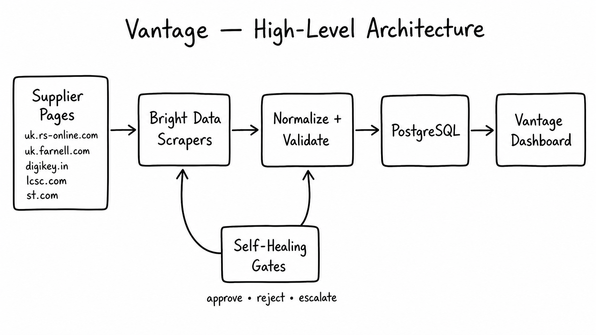
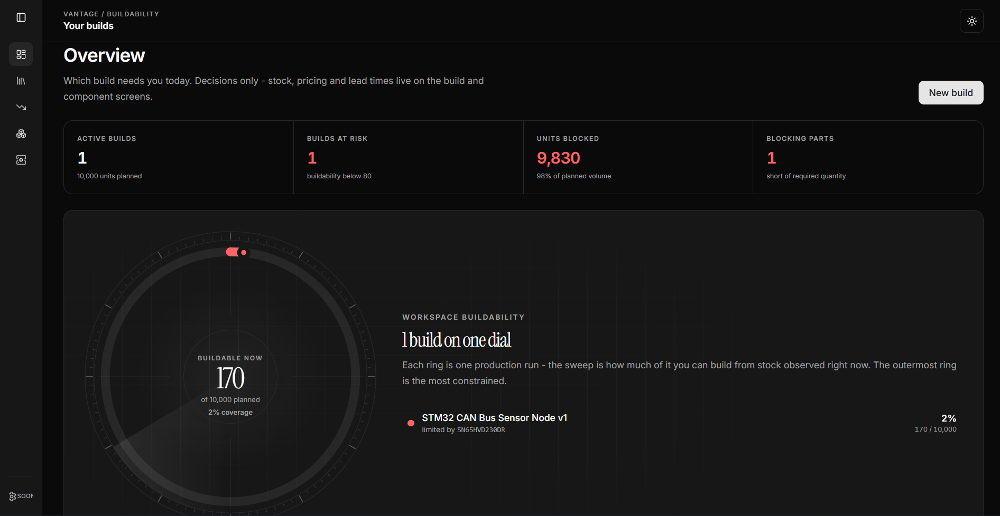
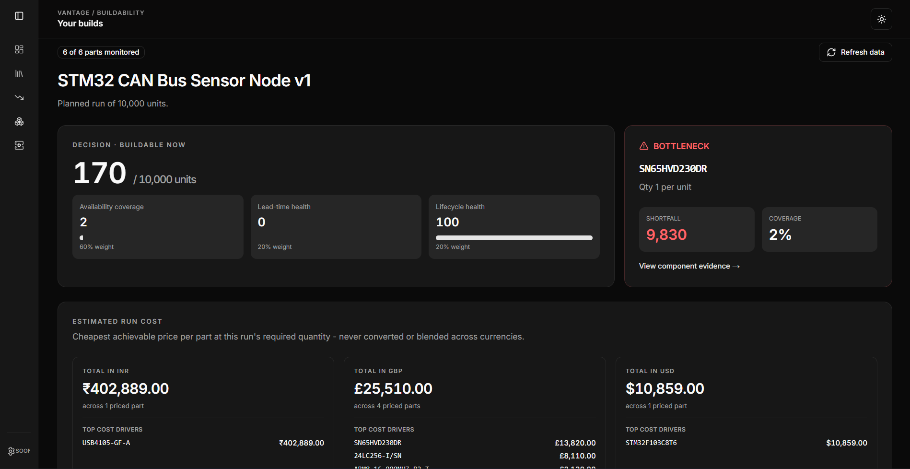
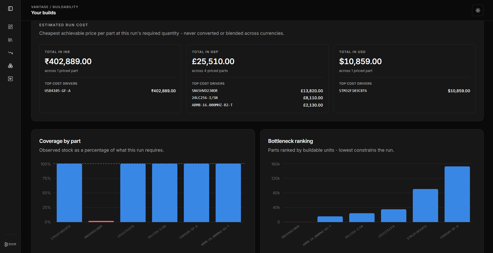
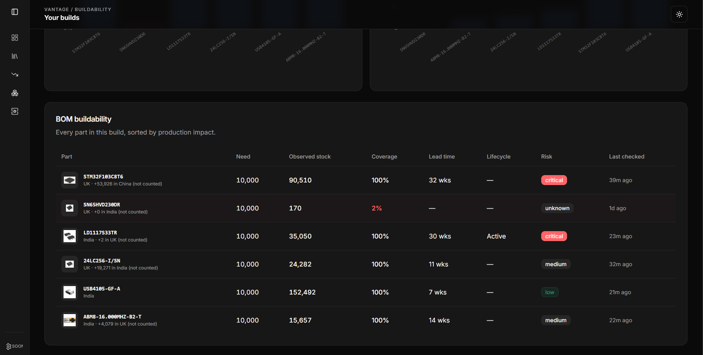
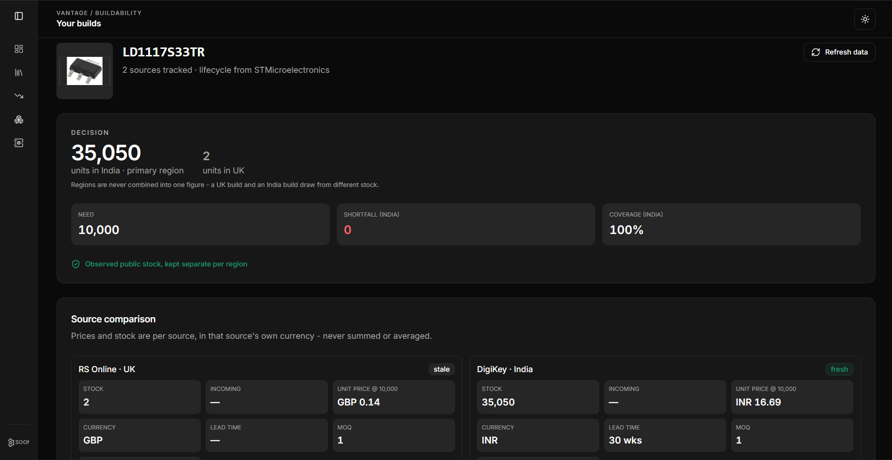
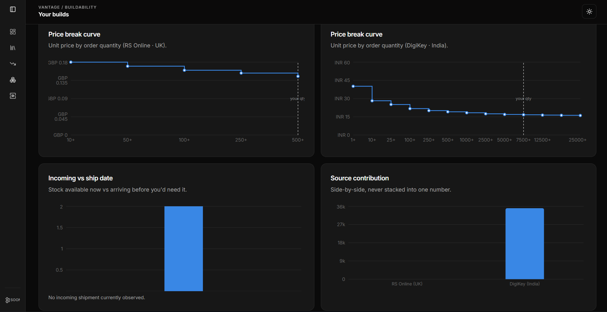
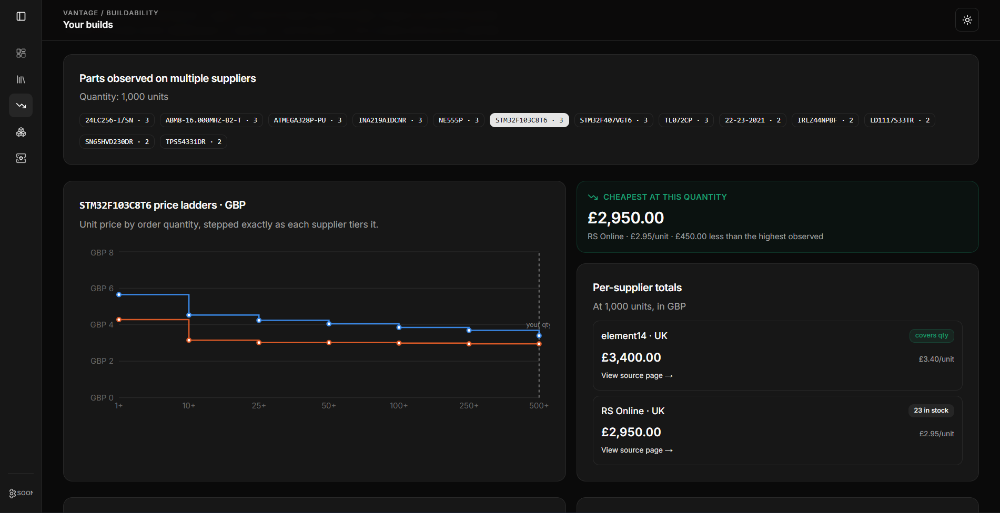

# Vantage

**Live app: [vantagezero.vercel.app](https://vantagezero.vercel.app)**

A hardware team commits to 500 units. Vantage answers the question that decides whether that
date holds: **how many can we actually build today, and which part stops us?**

It watches public distributor and manufacturer pages for stock, incoming quantity, lead time,
price breaks and lifecycle status.

When a supplier page changes *shape*, the collector heals in place. When supply *actually*
changes, the number moves. Vantage knows the difference.

| | |
|---|---|
| **Live app** | https://vantagezero.vercel.app |
| **Collectors** | 5 custom Scraper Studio collectors, 3 regions (UK, India, China) |
| **Example output** | [jump ↓](#example-structured-output) — one real capture per source |
| **Self-healing** | [jump ↓](#the-heal-loop-and-the-four-gates-day-5) — four gates, three outcomes |

## Architecture



Five supplier pages → Bright Data collectors → per-source normalize + Zod validate →
PostgreSQL → dashboard.

The self-healing gates feed back into **both** the scrapers and the validation step, and
resolve to one of three outcomes: **approve, reject, or escalate.**

### Demo video

[](https://www.youtube.com/watch?v=BlsxOLZN47E)

## Example structured output

Raw collector output (pre-normalization), one file per source, each captured from a real
live run — not hand-written:

| Source | File |
|---|---|
| RS Online | [`brightdata/examples/rs-uk-pdp-run.json`](brightdata/examples/rs-uk-pdp-run.json) |
| element14 | [`brightdata/examples/e14-uk-pdp-run.json`](brightdata/examples/e14-uk-pdp-run.json) |
| DigiKey India | [`brightdata/examples/digikey-in-pdp-run.json`](brightdata/examples/digikey-in-pdp-run.json) |
| LCSC | [`brightdata/examples/lcsc-cn-pdp-run.json`](brightdata/examples/lcsc-cn-pdp-run.json) |
| STMicroelectronics (manufacturer) | [`brightdata/examples/st-lifecycle-pdp-run.json`](brightdata/examples/st-lifecycle-pdp-run.json) |
| A heal in progress | [`brightdata/examples/st-lifecycle-heal.json`](brightdata/examples/st-lifecycle-heal.json) |

### Why four normalizers and not one

The same conceptual field is named and typed differently on every source. This is the whole
argument for custom collectors plus a per-source normalizer, and it's visible directly in the
files above — all four rows below describe *in-stock quantity, price tiers, and lead time*:

| | RS Online | element14 | DigiKey India | LCSC |
|---|---|---|---|---|
| MPN key | `mpn` | `manufacturer_part_number` | `mpn` | `mpn` |
| Price-break array | `bulk_price_breaks` | `price_breaks` | `price_breaks` | `price_breaks` |
| Break quantity | `"1 - 9"` (range) | `"1+"` | `1` (number) | `"1,000 +"` (comma) |
| Break price key | `unit_price.value` | `unit_price.value` | `unitPrice.value` | `unit_price.value` |
| Lead time | `lead_time_text` (prose) | `"32 weeks 32 weeks"` | `52` (number) | absent |
| `currency` | `"£"` (symbol) | `"GBP"` (ISO) | `"INR"` | `"USD"` |
| Incoming qty | absent | `incoming_quantity` | absent | absent |

Note `unitPrice` vs `unit_price`, `"1 - 9"` vs `1`, and a `currency` that is sometimes a symbol
and sometimes an ISO code. element14 even returns its lead time doubled
(`"32 weeks 32 weeks"`). A single generic product scraper cannot reconcile this; each
normalizer in `brightdata/normalize.ts` is the only place that ambiguity is allowed to live,
and every one of them is followed by the same Zod schema.

### Raw → normalized, end to end

Raw output from the LCSC collector (`c_mt44s8op4nh52dumy`) against a live product page:

```json
[
  {
    "mpn": "STM32F103C8T6",
    "manufacturer": "ST",
    "lcsc_part_number": "C8734",
    "in_stock_quantity": 57666,
    "package": "LQFP-48(7x7)",
    "minimum_order_quantity": 1,
    "order_multiple": 1,
    "currency": "USD",
    "price_breaks": [
      { "min_qty": "1 +", "unit_price": { "value": 1.7292, "currency": "USD", "symbol": "$" } },
      { "min_qty": "1,000 +", "unit_price": { "value": 1.0859, "currency": "USD", "symbol": "$" } }
    ],
    "product_image_url": "https://assets.lcsc.com/images/lcsc/900x900/20230221_STMicroelectronics-STM32F103C8T6_C8734_front.jpg",
    "input": { "url": "https://www.lcsc.com/product-detail/C8734.html" }
  }
]
```

Every field name here is source-specific and untrusted until normalized — `normalizeLcsc()`
(`brightdata/normalize.ts`) maps it into the same canonical shape every other source produces.
Abbreviated below (null fields omitted) for readability - this is the actual shape Zod
validates before a row is ever written:

```json
{
  "mpn": "STM32F103C8T6",
  "supplier": "LCSC",
  "region": "China",
  "stock": 57666,
  "currency": "USD",
  "minimumOrderQty": 1,
  "orderMultiple": 1,
  "priceBreaks": [
    { "minQty": 1, "unitPrice": 1.7292 },
    { "minQty": 1000, "unitPrice": 1.0859 }
  ],
  "package": "LQFP-48(7x7)"
}
```

### Self-healing output

A real heal, abridged from
[`brightdata/examples/st-lifecycle-heal.json`](brightdata/examples/st-lifecycle-heal.json).
The ST collector's `product_status` was returning duplicated, garbled text instead of a clean
value, so it was healed in place — **note the `collector_id` is unchanged**, which is the point:
every schedule, trigger and integration referencing that collector keeps working.

```json
{
  "collector_id": "c_msyu5pk9lpeacevev",
  "status": "awaiting_approval",
  "completed_steps": ["planner", "control_preview_runner", "code_fixer",
                      "step_preview_runner", "request_fulfillment_validator", "step_advance"],
  "prompt": "The product_status field returns duplicated repeated text instead of one clean value. Extract Marketing Status (e.g. Active, NRND, Obsolete) and Production Status as two separate short single-value string fields, no repetition. Also extract longevity_commitment_years and longevity_start_date if shown; else null.",
  "next_step": "bdata scraper approve c_msyu5pk9lpeacevev --url https://www.st.com/...",
  "preview_result": [
    {
      "product_name": "STM32F407VG",
      "marketing_status": "Active",
      "production_status": "Product is in volume production.",
      "longevity_commitment_years": 10,
      "longevity_start_date": "01/2026"
    }
  ]
}
```

One garbled field became four clean typed ones. Critically, the heal stops at
`awaiting_approval` rather than shipping — that preview is exactly what the four gates in
`domain/gates.ts` evaluate before anything is trusted (see
"[The heal loop and the four gates](#the-heal-loop-and-the-four-gates-day-5)" below). A healed
preview always *looks* plausible; looking plausible is not evidence of being right.

## Screenshots

**Landing page** — live buildability stats up front, not marketing copy alone.


**Dashboard overview** — which build needs attention today, on one dial.



**Build decision** — buildable units, the bottleneck part, and why.



**Run cost and coverage** — cheapest achievable price per part, coverage and bottleneck ranking charted.



**BOM buildability** — every part in the build, sorted by production impact.



**Source comparison** — regions never combined into one number; each source's stock, price and lead time stays separate.



**Price break curves** — unit price by order quantity, per supplier.



**Cross-supplier price comparison** — the same part priced across every supplier that carries it, cheapest highlighted.



## Sources

Five collectors, three regions. Every source was probed live before it was used — none were
picked by preference.

| Role | Source | Region | Collector |
|---|---|---|---|
| Distributor | RS Online (`uk.rs-online.com`) | UK | `c_msy7solmrxow00enh` |
| Distributor | element14 / Farnell (`uk.farnell.com`) | UK | `c_msyu5nup1i1bjgowvk` |
| Distributor | DigiKey India (`www.digikey.in`) | India | `c_mt1cydk063bbxlpux` |
| Distributor | LCSC (`www.lcsc.com`) | China | `c_mt44s8op4nh52dumy` |
| Manufacturer | STMicroelectronics (`www.st.com`) | — | `c_msyu5pk9lpeacevev` |

**Rejected, with evidence:**

- **Mouser India** — blocked outright (`captcha or protection page found` on the Web Unlocker).
- **Robu.in** — needs a full JS browser session, and even then exposes stock as a boolean
  "In Stock"/"Out of Stock". Never an exact count. Hard fail: `stock` is a required integer here,
  not an availability flag.
- **TME** — has an official public API, so "why not just use that?" would have an obvious
  answer. It wouldn't demonstrate anything Scraper Studio is for.

Stock is never summed across regions. A part in a UK warehouse isn't allocatable to an Indian
build, so every aggregate is labelled "observed public stock across tracked regional sites."

## Why not a pre-built scraper?

Bright Data ships 800+ prebuilt scrapers. None cover B2B component distributors — those are
trade catalogs, not consumer e-commerce.

More importantly, none extract the fields this project needs: **incoming quantity** (distinct
from in-stock), **manufacturer standard lead time**, **price breaks at a specific BOM
quantity**, and **lifecycle status** (marketing status, production status, longevity
commitment).

Each of the five collectors was built with `bdata scraper create` against one exact
product-detail-page URL, verified live on the Web Unlocker first.

## Terminal / app boundary

The app never creates, prompts, or heals a collector. That happens from the terminal
(`bdata scraper create` / `heal` / `approve`), like any other piece of infrastructure.

The app only *triggers a run* of an existing collector and *reads* the result. This keeps
"Bright Data collector" and "business data" as two separate concerns.

## Data pipeline

```
bdata scraper create   (terminal, one-time per source)
        ↓
source_targets row     (mpn, source, url, region, collector_id)
        ↓
scripts/ingest.ts --all   or   POST /api/ingest/webhook
        ↓
runScraper()  →  normalize (per-source)  →  Zod validation
        ↓                                         ↓
   all layers pass                          any layer fails
        ↓                                         ↓
  observation row                       scraper_incidents row
  (immutable, insert-only)              (no observation written —
                                         never a fabricated zero)
```

Two ways in, one validation path:

- **`.github/workflows/collect.yml`** — cron, every 6 hours, runs the CLI in the Actions runner.
- **`POST /api/ingest/webhook`** — a collector can POST straight to the app, no CLI needed.

Both funnel through the same function, so there's one implementation of "is this payload
trustworthy," not two.

## Getting started

```bash
npm install
cp .env.example .env.local   # fill in the three values below
npm run db:push              # create/update tables on your Postgres instance
npm run dev
```

Required environment variables (`.env.local`, never committed):

| Variable | Used for |
|---|---|
| `DATABASE_URL` | Postgres connection string (Neon/Supabase) |
| `BRIGHTDATA_API_KEY` | Passed explicitly to every `bdata` CLI call |
| `INGEST_API_TOKEN` | Bearer token required by `POST /api/ingest/brightdata` and the incidents/observations API (set the same value as a GitHub Actions secret, plus `APP_BASE_URL` pointing at your deployed URL, to enable the cron) |
| `SLACK_WEBHOOK_URL` | Optional. A Slack Incoming Webhook URL. Posts scraper incidents, heal escalations and critical buildability alerts - unset entirely no-ops all Slack output |
| `SLACK_ACTIVITY_FEED` | Optional. Set to `1` alongside `SLACK_WEBHOOK_URL` to also post one line per *successful* scrape - a live activity feed for a demo or a single-target run. Left unset on the cron and on bulk backfills (the catalog resolver): an `--all` cycle posts one per enabled source target, and Slack rate-limits that burst hard enough to drop the incident alerts underneath it |

## Current status

Real numbers from the live database, not placeholders — regenerate any time with
`npx tsx --env-file=.env.local scripts/stats.ts`:

- **5 custom Scraper Studio collectors**, all PDP scrapers: RS Online (24 tracked targets),
  element14 (26), DigiKey India (24), LCSC (1), STMicroelectronics (2, manufacturer lifecycle)
- **3 regions** — UK, India, China — each chosen by a live probe, not preference
- **34 distinct MPNs** across 77 source targets, spanning MCU, regulator, PMIC, PHY, memory,
  transceiver, connector, crystal, sensor, op-amp, MOSFET, ADC/DAC and protection categories
- **40 distributor observations, 2 manufacturer lifecycle observations** stored (insert-only)
- **93 collector runs** executed
- **51 scraper incidents** opened automatically rather than writing bad data — wrong-variant
  MPNs (a search matching `LM2596S-ADJ/NOPB` when `LM2596S-ADJ` was requested;
  `DS18B20-EV` for `DS18B20`), missing required fields on pages that don't render them, and
  one real bug in this repo's own RS normalizer (fixed; see `brightdata/normalize.ts`).
  Never a fabricated zero.
- 1 heal performed on the STMicroelectronics collector (see `brightdata/examples/st-lifecycle-heal.json`):
  the preview came back clean, but the approved production run did not pick up the fix. Root
  cause, found later: the approve call was missing `--auto-save`, so the healed template was
  never persisted back to the collector - approving resumed the paused job but left the saved
  template untouched. The flag is now wired through `approveHeal()` (see "Zero-touch without
  removing the gate" below). The ST normalizer still works around the original garbled field
  defensively, since the observations already on record were collected pre-fix

Unresolved catalog MPNs are left unresolved rather than forced. They fail for legitimate,
logged reasons — no matching organic search result, a page that doesn't render an exact stock
count, or a variant-suffix mismatch the identity check correctly rejected. Re-running
`scripts/resolve-catalog.ts` grows the catalog without touching what's already verified.

## Live MPN resolution: the catalog "floor" and the search "ceiling"

The seeded catalog (34 MPNs) is the floor — it resolves instantly because it's pre-verified.

For anything else, untracked rows get a **Search for this part** action.

We planned this as a "Search" type collector (keyword in, listings out), but both
distributors' multi-result search pages are **robots-disallowed**: RS Online's
`/*searchTerm=` is blocked outright, and element14's `/search?st=` is too. Only an exact
single match redirects to an allowed product page.

Rather than build against a disallowed path, live resolution uses Bright Data's Web Search
API (`db/catalog.ts`).

Either way, the pick goes through identical identity/shape validation. A wrong candidate — a
`/NOPB` or `-T26A` suffix variant — is rejected with a reason, never silently accepted.

## The heal loop and the four gates (Day 5)

A heal regenerates a collector's extraction logic from a description of what broke.

**The preview always *looks* plausible.** That's the trap. A healed selector can grab pin
count instead of stock and still return a perfectly valid number that parses cleanly — and
then go on to size a purchase order.

So `domain/gates.ts` runs four checks before any heal is trusted:

| Gate | Catches |
|---|---|
| Identity | The heal drifted to a different product on the page |
| Shape | A heal that fixes one field while silently dropping another |
| Continuity | An implausible jump from the last valid value (e.g. stock replaced by pin count) |
| Collision | The healed value exactly equals a different field on the same page (stock === incoming) |

**Identity and shape failures auto-reject** — they're unambiguously wrong.

**Continuity and collision failures escalate to a human** — a plausible-but-wrong value can't
be told apart from a real extreme change by magnitude alone.

`brightdata/heal.ts` runs the healed preview through the same normalize-and-validate pipeline
production ingestion uses, then these gates. One implementation of "is this heal trustworthy,"
not two.

Tests: `npm run test:gates` (`domain/gates.test.ts` covers all four gates).

### Zero-touch without removing the gate

Bright Data offers two ways to run a heal:

- **`bdata scraper heal`** — pauses at `user_approval` for a person to eyeball the diff. Safe,
  but doesn't run unattended.
- **`heal --auto-approve`** — skips the gate entirely. Unattended, but ships any diff that
  parses.

Vantage takes a third option: **keep the gate, replace the reviewer.** The four gates hold the
approval authority, so the loop is unattended *and* verified.

| | Unattended | Verified |
|---|---|---|
| `heal`, human approves in the UI | ✗ | ✓ (a person reads the diff) |
| `heal --auto-approve` | ✓ | ✗ (any parseable diff ships) |
| Vantage's gated loop | ✓ | ✓ (four gates decide; humans see only the ambiguous cases) |

The three gate decisions map onto three genuinely distinct end states, not three log lines:

| Decision | Action | Collector state |
|---|---|---|
| `auto_approve` | `approve --auto-save` | Healed template **persisted to production** |
| `auto_reject` | `approve --reject`, reheal with a sharper prompt | Unchanged; job ended |
| `escalate` | Left in `pending_answer`, Slack alert sent | Awaiting a human on `/dashboard/sources` |

**`--auto-save` is what makes the approve path durable.** Without it, an approval resumes the
paused job but never writes the healed template back to the collector.

The fix works once, the collector reverts, and the next cron cycle re-breaks on the same
selector — healing the identical break forever.

That's exactly what bit the ST collector: the one heal in the counts above whose clean preview
never reached production. Root cause was a missing flag, not a platform quirk.

The read/write API surface for this (`GET /api/incidents/open`, `GET
/api/observations/latest-valid`, `POST /api/incidents/[id]/resolve`) is bearer-token
protected like the ingestion endpoint, and never calls `bdata scraper create/heal` itself -
per the terminal/app boundary above, that orchestration (the actual CI heal loop and the
live rehearsal) is driven from the coding-agent CLI, not from Vantage's own backend. The one
exception is `POST /api/incidents/[id]/approve`: a human approving or rejecting an
already-escalated incident from the **Source health** screen (`/dashboard/sources`) - acting
on a decision, not authoring a scraper.

## AI assistance disclosure

This project was built with an AI coding assistant (Claude Code), and the Bright Data
collectors were created and healed by driving the `bdata` CLI from that same terminal — which
is the workflow Scraper Studio is designed for.

What the assistant did: scaffolding, React/Tailwind components, boilerplate, test cases, and
drafting prose in this README.

What I decided and can explain:

- Which sources to use and why — each probed live, with the rejections documented above
- The four heal gates and their decision rule, including why identity/shape auto-reject while
  continuity/collision escalate
- The per-source normalizer field mappings
- The schema and its insert-only observation model
- The rule that a failed validation opens an incident rather than writing a zero

**Separately — an LLM at runtime.** The app uses Groq for two product features: the guided
"Help me choose parts" flow and alternative-part suggestions.

Both treat the model as untrusted. Every part it names is re-verified against the real tracked
catalog before being labelled "tracked" (`domain/design.ts`, `domain/alternatives.ts`).

**No scraped value is ever produced by an LLM.**

## Limitations

Vantage does **not** guarantee that:

- Inventory is still available when a PO is placed
- Distributor stock is globally allocatable
- Lead-time text equals a delivery date
- These distributors represent the whole market
- Production ships on component availability alone

Buildable-unit math is floor division and doesn't account for minimum order quantity or order
multiple — though both are captured. Component images are hotlinked from the source, not
rehosted.

**Known gap:** the DigiKey India collector doesn't reliably extract price breaks on every page
— a full table for `LM2596S-ADJ/NOPB`, an empty one for `STM32F407VGT6` (whose page does have
a price table).

Stock, currency and lead time are unaffected. The UI renders an empty price-break array as
"—", never a wrong number, so this is a coverage gap rather than a correctness bug. A heal pass
would be the fix.
